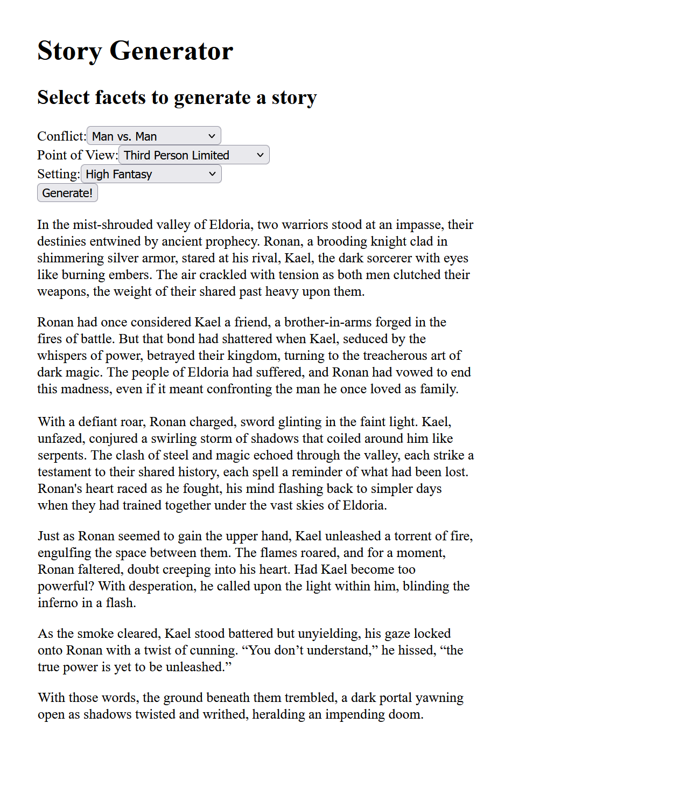

# Story Generator

This takes user input defining some things that describe a story and uses ChatGPT to generate a story to match. At the moment it's a very light proof of concept.

## Usage

* Create an an `api-key.txt` file in the parent directory with an OpenAI API key. Get one here: https://platform.openai.com/settings/organization/billing/overview.
* `npm run dev`
* In a browser, navigate to http://localhost:3000/generate-story

## Example

...

This is a [Next.js](https://nextjs.org/) project bootstrapped with [`create-next-app`](https://github.com/vercel/next.js/tree/canary/packages/create-next-app).